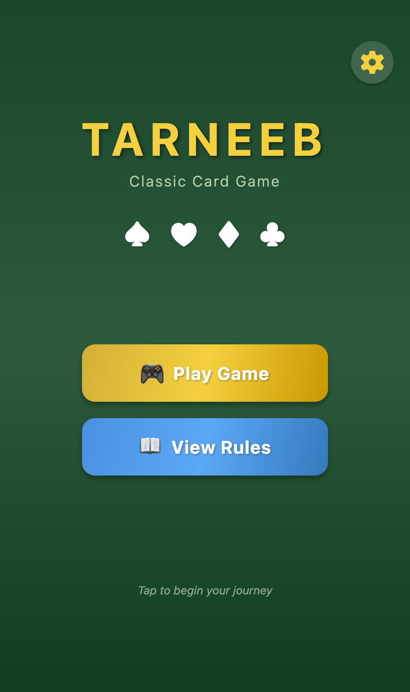
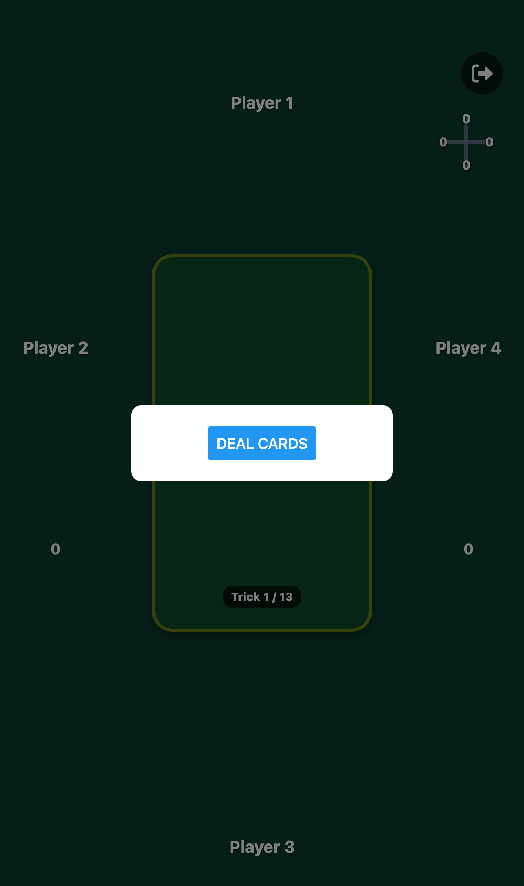
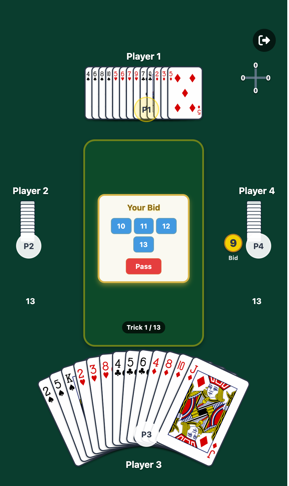
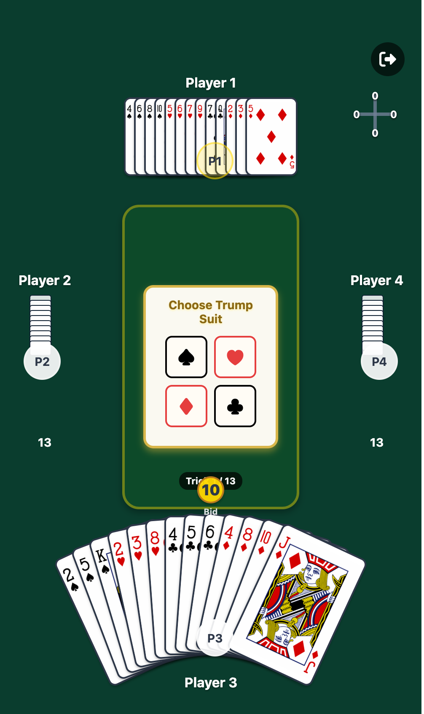
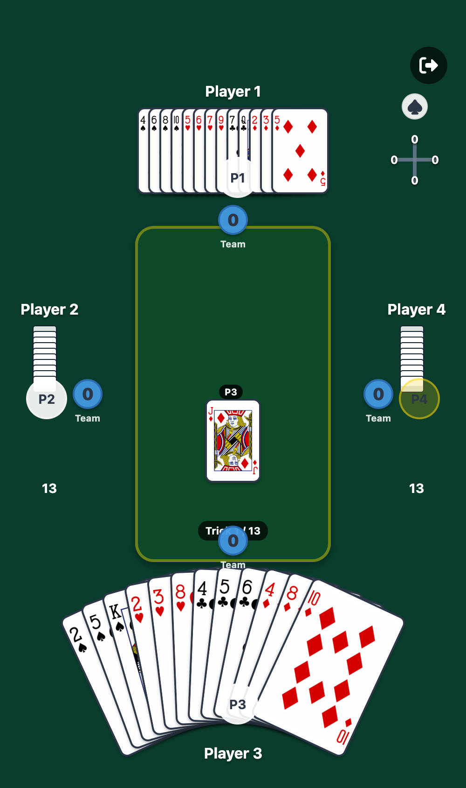
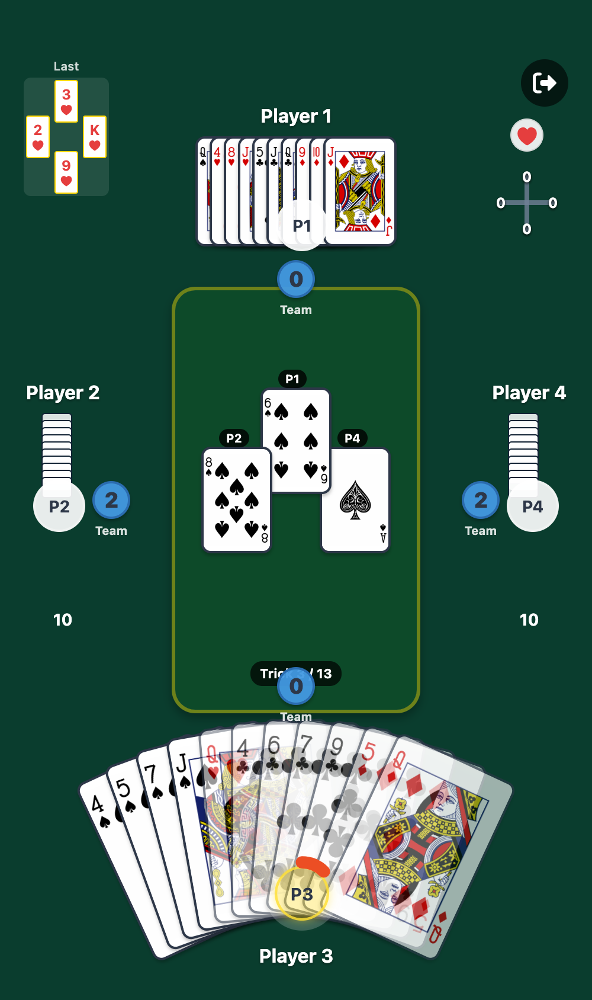
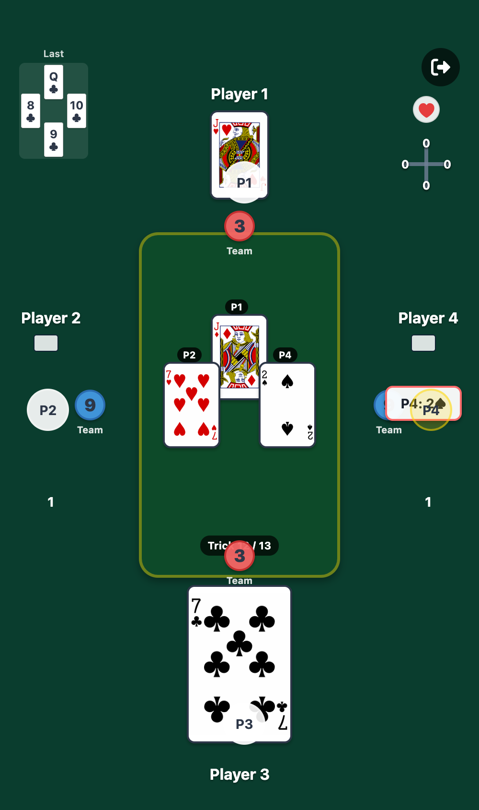

# Tarneeb Card Game

A fully-featured mobile implementation of Tarneeb, a popular Middle Eastern trick-taking card game, built with React Native and Expo.

## 📱 About the Game

Tarneeb is a four-player partnership trick-taking card game played with a standard 52-card deck. Players sitting opposite each other form teams, and the objective is to win tricks containing valuable cards. The game involves bidding, trump selection, and strategic card play.

## ✨ Features

- **Full Tarneeb Gameplay**: Complete implementation of bidding, trump selection, and trick-taking
- **Single Player Mode**: Play against three AI opponents with strategic bidding and play logic
- **Beautiful UI**: Card animations, smooth transitions, and intuitive interface
- **Score Tracking**: Round-by-round score tracking with game history
- **Game Rules**: Built-in rules screen for learning the game
- **Settings**: Customizable game settings and preferences

## 🎮 Game Flow

### 1. Starting the App



*Expo development server running*

### 2. Game Screen



*Initial game screen with player positions*

### 3. Cards Dealt


*Cards dealt to all players*

### 4. Bidding Phase



*Interactive bidding modal for human player*

### 5. After Bidding



*Game state after bidding is complete*

### 6. Playing Phase


*Active gameplay - players taking tricks*

### 7. Trick in Progress



*A trick in progress with cards played*

### 8. Game State


*End of round/game state*

### 9. AI System



*AI opponents making strategic decisions*

### 10. Current Gameplay



*Current state of gameplay*

## 🚀 Getting Started

### Prerequisites

- Node.js (v14 or higher)
- npm or yarn
- Expo CLI
- iOS Simulator (for iOS development) or Android Emulator (for Android development)

### Installation

1. Clone the repository:
   ```bash
   git clone <repository-url>
   cd <project-directory>
   ```

2. Install dependencies:
   ```bash
   npm install
   ```

3. Start the development server:
   ```bash
   npm run start
   ```

4. Run on your platform:
   ```bash
   npm run ios     # For iOS
   npm run android # For Android
   npm run web     # For web (experimental)
   ```

## 🏗️ Project Structure

```
.
├── App.js                      # Main app entry point with navigation
├── screens/                    # Screen components
│   ├── HomeScreen.js          # Landing screen
│   ├── GameScreen.js          # Main game screen
│   ├── RulesScreen.js         # Game rules
│   ├── SettingsScreen.js      # Settings screen
│   └── ScoresScreen.js        # Score history
├── components/                 # Reusable UI components
│   ├── Card.js                # Card component
│   ├── Hand.js                # Player hand component
│   ├── TrickArea.js           # Central trick area
│   ├── GameHUD.js             # Game HUD display
│   └── ...                    # Other components
├── utils/                      # Game logic and utilities
│   ├── gameLogic.js           # Core game logic
│   ├── AiLogic.js             # AI decision making
│   ├── biddingStrategy.js     # AI bidding strategy
│   ├── engine/                # Game engine
│   │   └── PlayEngine.js      # Play engine logic
│   └── state/                 # State management
│       ├── GameReducer.js     # Game state reducer
│       └── GameStateContext.js # Game state context
├── assets/                     # Images and assets
│   └── img/cards/             # Card images
├── docs/                       # Documentation
└── __tests__/                 # Test files
```

## 🎯 Game Rules

### Teams
- **Team 1**: Players 0 and 2 (North and South)
- **Team 2**: Players 1 and 3 (East and West)

### Bidding
- Bidding starts with the player to the right of the dealer
- Players bid or pass in anticlockwise order
- Minimum bid is 7 tricks, maximum is 13
- Highest bidder becomes the declarer and chooses trump suit

### Playing
- Declarer leads the first trick
- Players must follow suit if possible
- Highest trump card wins, or highest card of lead suit
- Winner of each trick leads the next

### Scoring
- Declaring team scores points equal to their bid if they make it
- If they fail, they lose points equal to their bid
- Opposing team always scores the number of tricks they won
- First team to reach the target score wins

## 🧪 Testing

Run the test suite:

```bash
npm test
```

Run tests in watch mode:
```bash
npm test -- --watch
```

Test coverage:
```bash
npm test -- --coverage
```

## 🛠️ Technologies Used

- **React Native 0.73** - Mobile app framework
- **React 18** - UI library
- **Expo ~50** - Development platform
- **React Navigation** - Navigation library
- **React Native SVG** - Vector graphics
- **Jest** - Testing framework
- **React Native Testing Library** - Component testing

## 🚀 Deployment & CI/CD

This project includes comprehensive GitHub Actions workflows for automated testing, building, and deployment:

### Available Workflows

- **Test Suite** - Automated testing with coverage reports
- **Expo Preview** - Quick preview builds for testing with Expo Go
- **Android APK Build** - Standalone Android app builds
- **iOS App Build** - iOS app builds for TestFlight/App Store
- **OTA Updates** - Over-the-air updates for deployed apps

For detailed setup and usage instructions, see [DEPLOYMENT.md](DEPLOYMENT.md).

### Quick Start with GitHub Actions

1. Add your `EXPO_TOKEN` to GitHub Secrets
2. Push to `main` or create a PR
3. Workflows automatically run tests and builds
4. Download builds from Actions artifacts

See [DEPLOYMENT.md](DEPLOYMENT.md) for complete setup instructions.

## 📚 Documentation

Comprehensive documentation is available in the `docs/` directory:

- [Game Flow](docs/GAME_FLOW.md) - Detailed game flow and state transitions
- [Component Documentation](docs/README.md) - Component usage and API
- [Animation Guide](docs/ANIMATION_QUICK_START.md) - Animation implementation
- [Performance Analysis](docs/performance_analysis/) - Performance optimization notes

## 🤝 Contributing

Contributions are welcome! Please follow these guidelines:

1. Fork the repository
2. Create a feature branch
3. Make your changes with clear commit messages
4. Add tests for new features
5. Ensure all tests pass
6. Submit a pull request

## 📝 Development Notes

- The human player is Player 3 (index 2) by default
- Turn order is anticlockwise for both bidding and playing
- All game state is managed through the GameReducer
- Card animations use React Native's Animated API
- AI logic is modular and can be enhanced independently

## 🐛 Known Issues

- See [GitHub Issues](../../issues) for current known issues
- Check [docs/UPDATE_DEPTH_WARNING.md](docs/UPDATE_DEPTH_WARNING.md) for historical debugging notes

## 📄 License

[Add your license here]

## 👥 Authors

[Add author information here]

## 🙏 Acknowledgments

- Card images from [source]
- Tarneeb rules and gameplay based on traditional Middle Eastern card game
- Built with React Native and Expo

---

**Last Updated**: January 2026  
**Version**: 1.0.0
