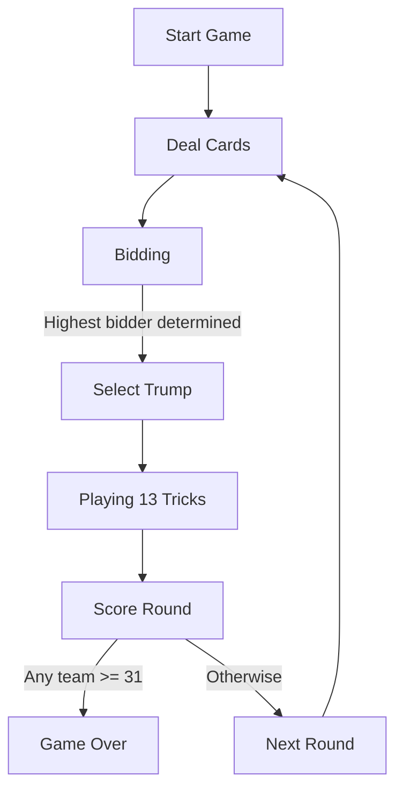
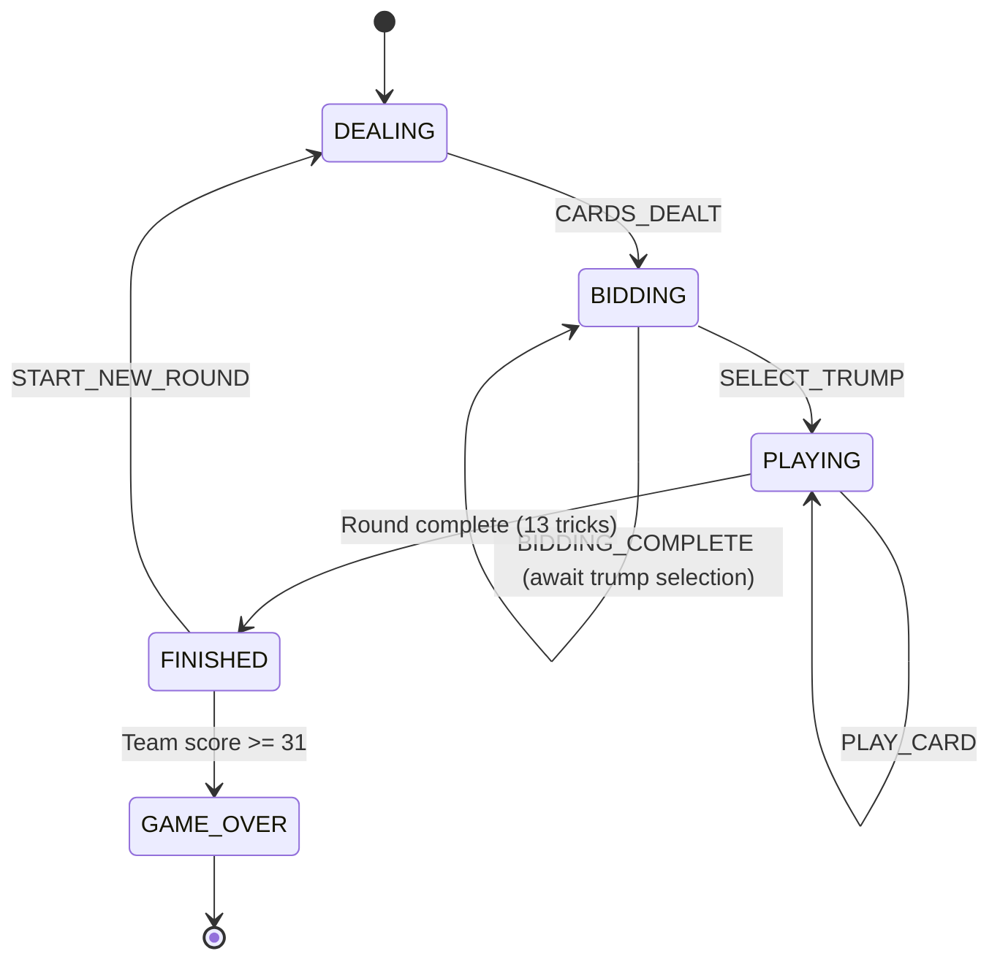
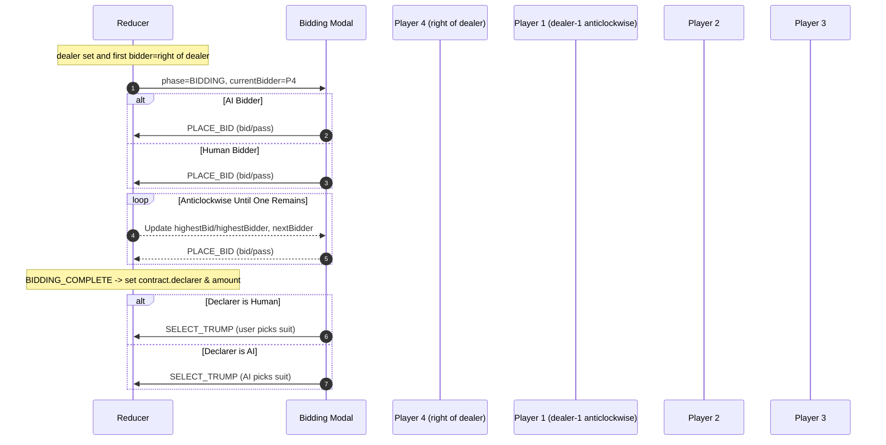
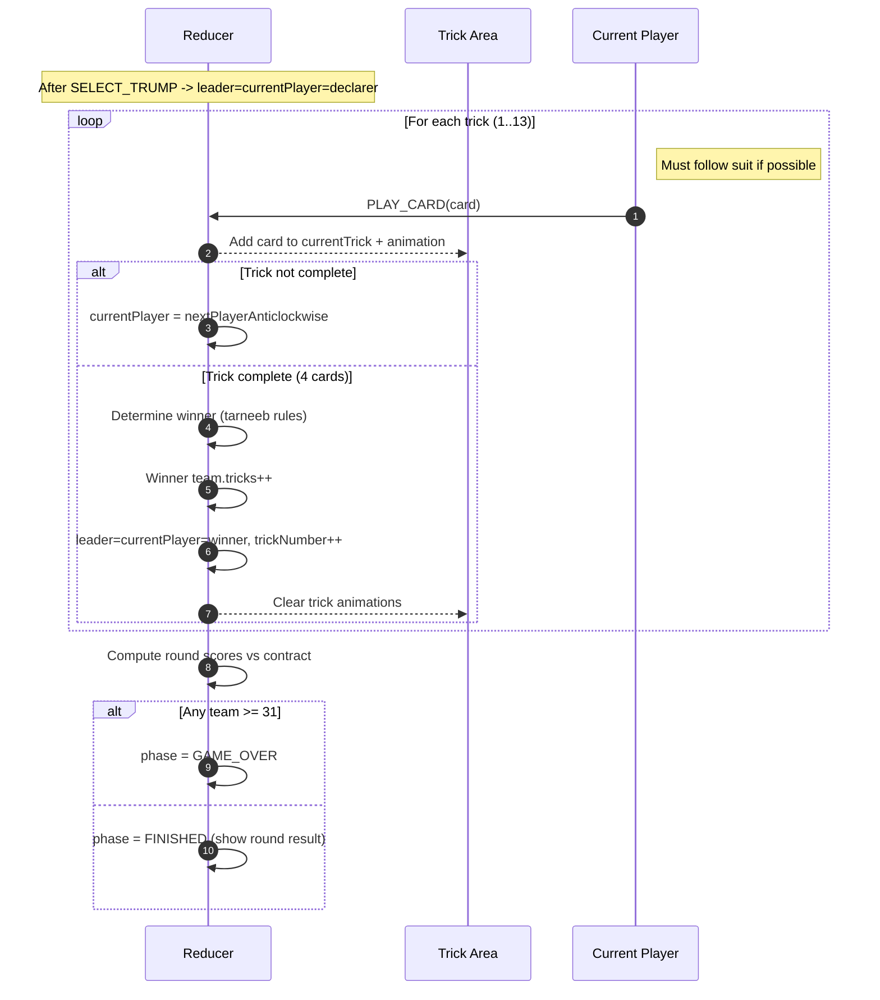

# Mermaid Diagrams: Tarneeb Game Flow and AI Design

This document contains a set of Mermaid diagrams that illustrate:
- High-level game flow hierarchy
- State machine details (phases and transitions)
- Bidding sequence and rules
- Playing/trick sequence
- AI decision flow for playing a card
- Module/component architecture


## 1) High-level Game Flow (Hierarchy)



## 2) State Machine (Phases and Transitions)



## 3) Bidding Sequence (Right-of-Dealer, Anticlockwise)



## 4) Playing / Trick Sequence



## 5) AI Decision Flow for Playing a Card
```mermaid
flowchart TD
  A[Choose AI Card] --> B{Position in Trick}
  B -->|0 (Lead)| L0
  B -->|1 (Second)| L1
  B -->|2 (Third)| L2
  B -->|3 (Fourth)| L3

  L0[Lead] --> C{Many trumps (>=5)?}
  C -->|Yes| C1[Lead lowest trump]
  C -->|No| C2[Pick strongest non-trump suit (AK+length)]
  C2 --> C3[Lead highest of that suit]

  L1[Second] --> D{Can follow suit?}
  D -->|Yes| D1[Win with minimal higher vs lead if possible]
  D -->|No| D2{Have trump?}
  D2 -->|Yes| D3[Play lowest trump]
  D2 -->|No| D4[Discard lowest]

  L2[Third] --> E{Is partner winning now?}
  E -->|Yes| E1[Conserve: lowest following suit else lowest non-trump]
  E -->|No| E2[Try minimal winning card]

  L3[Fourth] --> F{Is partner winning now?}
  F -->|Yes| F1[Conserve: lowest legal, prefer low of lead suit]
  F -->|No| F2[Win with cheapest winning card]
```


## 6) Module/Component Architecture
```mermaid
classDiagram
  class GameScreen {
    +useReducer(gameReducer)
    +AI move effect (uses PlayEngine)
    +Bidding modal integration
  }
  class GameReducer {
    +phase: DEALING|BIDDING|PLAYING|FINISHED|GAME_OVER
    +dealer, round
    +bidding{ currentBidder, highestBid, highestBidder, playersStillBidding }
    +contract{ declarer, amount, trumpSuit, declarerTeam }
    +playing{ currentPlayer, leader, currentTrick, trickNumber, leadSuit }
    +teams{ team1, team2 }
    +PLACE_BID / SELECT_TRUMP / PLAY_CARD / etc.
  }
  class PlayEngine {
    +nextPlayerClockwise()
    +legalCardsFor(hand, leadSuit)
    +chooseAiCardSmart(ctx)
  }
  class BiddingStrategy {
    +evaluateHandStrength(hand)
    +evaluateBid(hand, highestBid, highestBidder, currentBidder)
    +chooseTrumpSuit(hand)
  }
  class BiddingModal {
    +AI auto-bid & trump select
    +Human bid & trump select
  }
  class GameValidation {
    +isLegalPlay(card, hand, leadSuit)
    +validateGameState(state)
  }

  GameScreen --> GameReducer : dispatch actions
  GameScreen --> PlayEngine : AI card selection
  GameScreen --> BiddingModal : show/hide & callbacks
  GameReducer --> PlayEngine : nextPlayerAnticlockwise
  BiddingModal --> BiddingStrategy : AI bidding & trump
  GameScreen --> GameValidation : pre-validate plays
  GameReducer --> GameValidation : reducer-level validation
```

Notes
- Bidding and playing both proceed anticlockwise. First bidder is to the right of the dealer (dealer bids last). Declarer selects tarneeb and leads first.
- Reducer enforces legal play even if UI/AI attempts off-suit when following suit is possible.
- AI “don’t waste high cards” rules are baked into position-aware choices and partner-winning checks.
